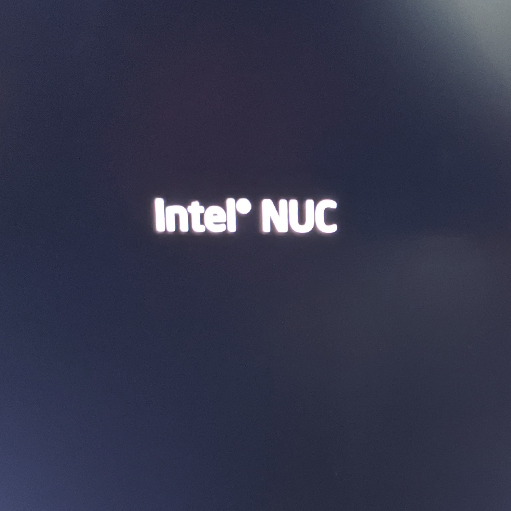
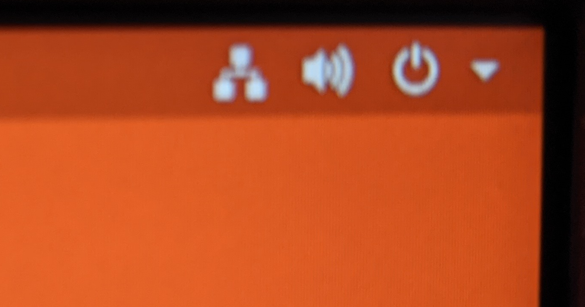

# Install Ubuntu

This documentation describes how to configure an ubuntu installation for compatibility with the stretch installation procedure.

# Ubuntu Image

The stretch_installatioon script is inteneded to be used with an 18.04.1 amd64 ubuntu desktop image found herehe image can be found here: 

http://old-releases.ubuntu.com/releases/18.04.1/ubuntu-18.04.1-desktop-amd64.iso

# Ubuntu Installation

Insert a bootable drive with the ubuntu image referenced above into a powered off NUC.

Next power on the NUC and at the bios startup screen (shown below) press *F10* when prompted to enter the boot menu.

From the boot menu select 'OS BOOTLOADER' 

From here the the NUC should load load the grub bootloader and display a menu similar to what is shown below:

From this menu select 'install ubuntu'. The Ubuntu os will begin to run and launch the ubuntu installation tool.

At the first screen you will be prompted to select a language for the system. Select 'English' as shown below

Next you will be prompted to select a keyboard layout. Select 'English(US)'.

The next page will show a menu to select a wifi network if you are not already connected.

It is suggested to use a wired connection if possible for a faster install; your connection status should be visible in the top right of the display

On the next page titled 'Updates and other software' Select 'minimal installation' under 'What apps would you like to install to start with?'

Also,

check the box next to 'Download updates while installing Ubuntu' (this option will be unavailable if there is no interent connection)

and,

uncheck 'Install third-party software for graphics and Wi-Fi hardware and additional media formats'

Next yhere will be a prompt for installing 3rd party software.

On the next page titled 'Installation type', select 'Erase disk and install Ubuntu'

 

There will be a prompt to confirm you wish to create the appropriate partitions for the ubuntu install.

Ensure there is nothing on the harddrive you wish to save before selecting continue

Next select the default west-coast ubuntu location 'Los Angeles'

Finally enter the identifying information as written below replacing '1000' with the appropriate sreial number for the robot. 

name:           Hello Robot Inc.
computer name:  stretch-re1-1000
username:       hello-robot
password:       hello2020

Also select the 'Log in automatically' option. When finished the 'Who are you' page should look like the picture below.

Ubuntu will now be installed.

After the installation if completed You will be prompted to renmove the installation medium and restart.

Remove the installation medium and hold the power button to turn off the NUC.

**Ubuntu is now installed.**